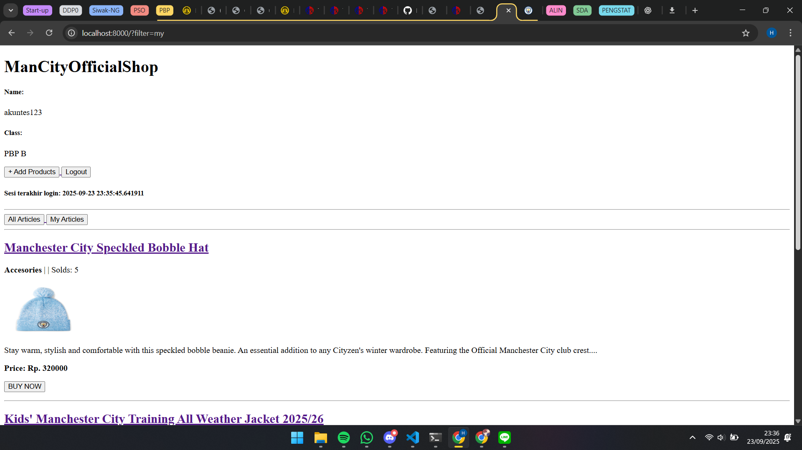
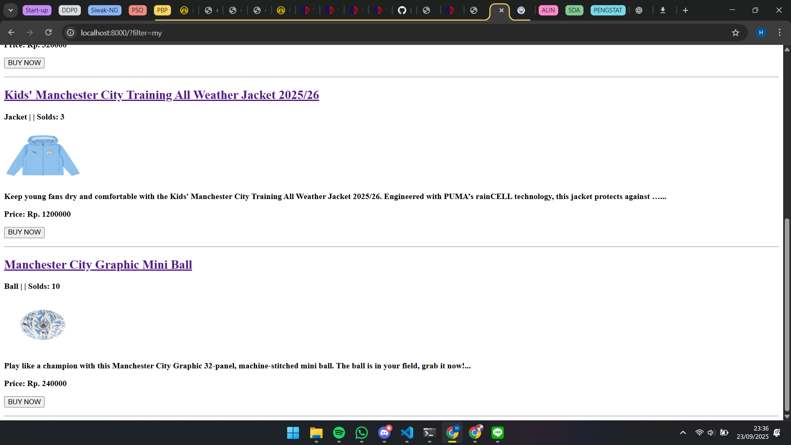
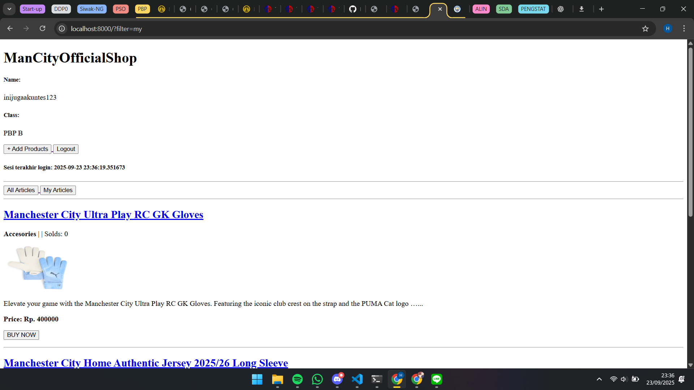
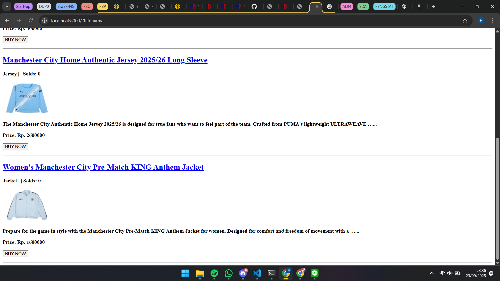
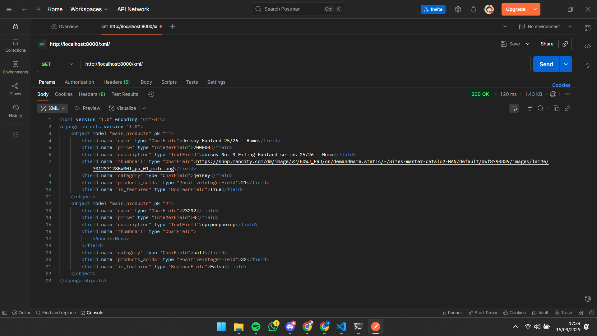
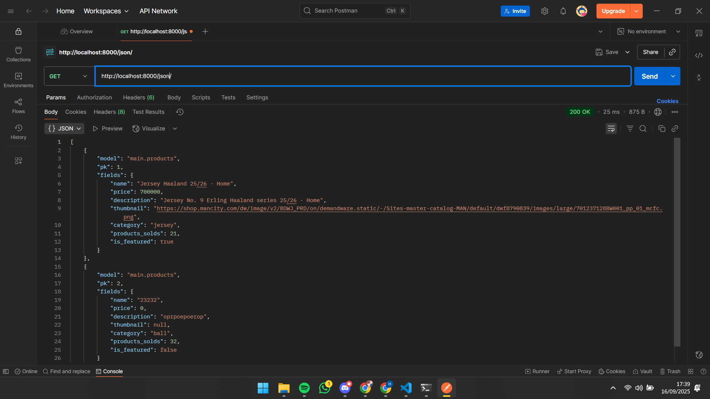
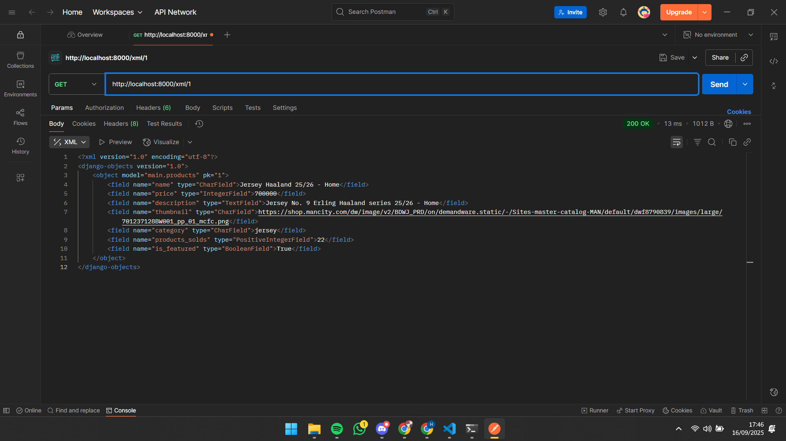
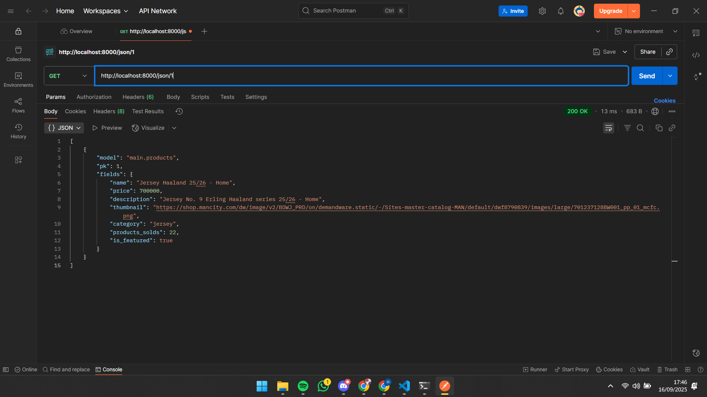
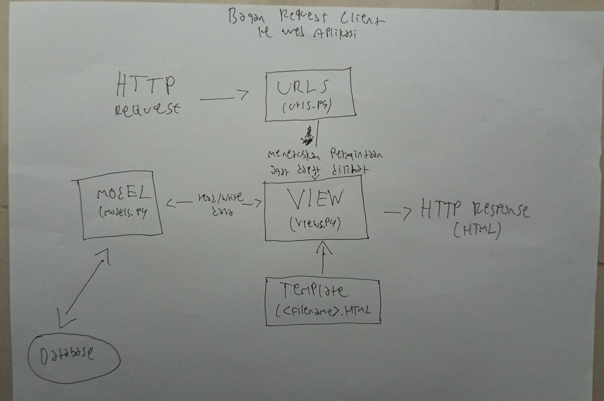

## Tugas 4:
1. Apa itu Django AuthenticationForm? Jelaskan juga kelebihan dan kekurangannya.
Jawab: AuthenticationForm itu adalah form bawaan dari Django untuk login user. ia menyediakan 2 field yaitu username dan password. Ketika form divalidasi dengan is_valid(), maka Django akan otomatis mengecek apakah usernamenya terdaftar, lalu memverifikasi password apakah sesuai lalu menyimpan objek user yang valid tersebut di dalam form.get_user(). Kelebihan dari ini adalah ia bawaan Django sehingga mudah langsung digunakan aja lalu dapat dikustomisasi. Kekurangannya ia hanya mendukung autentikasi dengan username dan password saja, tidak bisa lewat email/OTP/dll.

2. Apa perbedaan antara autentikasi dan otorisasi? Bagaiamana Django mengimplementasikan kedua konsep tersebut?
Jawab: Autentikasi adalah proses untuk memverifikasi identitas user, apakah dia beneran siapa yang dia klaim sedangkan otorisasi adalah proses untuk memberikan atau membatasi hak akses setelah identitas user diverifikasi seperti admin bisa menghapus data namun user biasa tidak bisa. Django punya sistem autentikai bawaan lewat django.contrib.auth, baru nanti bila sudah di autentikasi barulah user di otorisasi dengan sistem permissions dan groups, akses apa saja yang diberikan, masuk ke grup apa yang bisa mengakses apa.

3. Apa saja kelebihan dan kekurangan session dan cookies dalam konteks menyimpan state di aplikasi web?
Jawab: Cookie: Kelebihannya ia sederhana dan langsung, disimpannya di browser jadi tak perlu repot disimpan. Selain itu kompatibilitasnya juga luas. Kekurangannya adalah ukurannya terbatas karena maksimal hanya 4kb per Cookie. Ia juga tidak cocok untuk menyimpan data sensitif seperti password. Sessions: Dia lebih aman dari Cookie karena data tidak disimpan di browser sehingga cocok untuk data sensitif. Kekurangannya adalah ia membebani server karena harus disimpan di memory/database server.

4. Apakah penggunaan cookies aman secara default dalam pengembangan web, atau apakah ada risiko potensial yang harus diwaspadai? Bagaimana Django menangani hal tersebut?
Jawab: Tentu saja tidak sepenuhnya aman, ada beberapa resiko potensial yang harus diwaspadi seperti CSRF, XSS, dan resiko lainnya. Cara django mengatasi hal tersebut adalah dengan menggunakan sdrf protection yaitu dengan menambahkan csrftoken pada form POST. Lalu ada juga signed cookies dimana cookie ditandatangani dengans ecret key sehingga user tidak bisa mengubah nilainya diam-diam. Intinya selalu ada resiko namun bisa kita kurangi dengan menerapkan beberapa fitur yang telah disediakan oleh Django.

5. Jelaskan bagaimana cara kamu mengimplementasikan checklist di atas secara step-by-step (bukan hanya sekadar mengikuti tutorial).
Jawab: Saya mengikuti langkah-langkah di tutorial 3, namun di lcoal saya banyak produk yang sudah saya buat berstatus masih unknown dengan judul yang kurang jelas sehingga menurut saya mengganggu pemandangan, akhirnya saya membuat fitur untuk dapat menghapus produk, Setelah itu tidak banyak hal lain yang saya lakukan selan mengikuti tutorial dan memodifikasi beberapa bagian, sekarang saya sedang mengerjakan readme.md sebelum di up ke git dan pws.

6.    

## Tugas 3:
1. Jelaskan mengapa kita memerlukan data delivery dalam pengimplementasian sebuah platform?
Jawab: Jadi data delivery diperlukan agar informasi bisa sampai kepengguna atau sistem lain, memastikan datanya sampai dengan tepat, harus akurat sama dengan yang dikirim, lalu aman, dan minim delay. Selain itu data delivery itu mendukung skalabilitas platform dan bisa menjadi dasar integrasi dengan sistem lain. Bila tanpa data delivery, nanti platform hanya akan jadi tempat penyimpanan data pasif, bukan sistem yang bisa interaktif dan bermanfaat.

2. Menurutmu, mana yang lebih baik antara XML dan JSON? Mengapa JSON lebih populer dibandingkan XML?
Jawab: JSON lebih populer mungkin karena ia lebih sederhana dan singkat, ia lebih mudah dibaca. Selain itu parsing json juga lebih cepat dan lebih ringan ukuran datanya.

3. Jelaskan fungsi dari method is_valid() pada form Django dan mengapa kita membutuhkan method tersebut?
Jawab: jadi is_valid() itu dibutuhkan untuk mengecek apakah data yang sudah dikirim melalui form sudah sesuai dengan aturan validasi atau belum. Jika ia valid maka ia mengembalikan true sedangkan bila tidak valid maka ia akan mengembalikan false dan tersimpan di form.errors.

4. Mengapa kita membutuhkan csrf_token saat membuat form di Django? Apa yang dapat terjadi jika kita tidak menambahkan csrf_token pada form Django? Bagaimana hal tersebut dapat dimanfaatkan oleh penyerang?
Jawab: csrf_token atau Cross-Site Request Forfery Protection adalah token unik yang disispkan di setiap form HTML yang melakukan post Request. Saat disubmit, token ini akan dikirim kembali ke server dan dicocokkan, jika cocok maka request sah bila tidak maka akan ditolak. Jika tidak ada csrf_token, maka bisa ada form palsu yang mengirim request ke Django tanpa izin kita namun dianggap sah. Penyerang dapat memanfaatkan hal tersebut dengan memberikan request jahat kepada server kita, bisa saja data kita terhapus, melakukan transaksi, dan hal berbahaya lainnya.  

5. Jelaskan bagaimana cara kamu mengimplementasikan checklist di atas secara step-by-step (bukan hanya sekadar mengikuti tutorial).
Jawab: Jadi pertama-tama saya mengikuti alur yang ditunjukkan pada tutorial 2, membuat forms, memperbarui views, main, lalu membuat create_products.html, products_detail.html yang dimana walaupun sudah diberitahu templatenya oleh tutorial, saya harus menyesuaikannya agar sesuai dengan toko yang saya buat. Ada banyak hal yang terlewat saat saya mengerjakan sehingga saya harus lebih teliti karena ada beberapa yang tidak muncul saat pertama kali saya Run seperti description yang tidak muncul, jumlah views tidak muncul di main, dll. Namun setelah inspeksi saya berhasil memperbarui kodenya. Setelah itu saya membuat def xml, json, xml by id, dan json by id lalu saya membuka postman dan saya Screenshot lalu sekarang saya sedang mengerjakan readme.md.

6. Apakah ada feedback untuk asdos di tutorial 2 yang sudah kalian kerjakan?
Jawab: Tidak ada, saya ada pertanyaan pada tutorial 2 kemarin dan saya masuk ke voice discord lalu asdos sudah mengarahkan dan menjawab pertanyaan saya.

7. Mengakses keempat URL di poin 2 menggunakan Postman, membuat screenshot dari hasil akses URL pada Postman, dan menambahkannya ke dalam Readme.md
    

## Tugas 2:
1. https://hammam-muhammad-mancityofficialshop.pbp.cs.ui.ac.id/

2. Jelaskan bagaimana cara kamu mengimplementasikan checklist di atas secara step-by-step (bukan hanya sekadar mengikuti tutorial)
Jawab: Pertama-tama saya mengikuti dari tutorial 0, saya ikuti semuanya, di bagian DB_NAME, DB_HOST, dll saya langsung ubah sesuai data yang dikirimkan ke gmail, tidak sepertu tutorial 0 yang dibiarkan default. Lalu saya lanjutkan sesuai tutorial 0. Nah saat itulah muncul masalah saat saya up ke PWS, dikarenakan dia failed, ternyata nama git tidak boleh ada huruf kapital jadi saya pusing dulu untuk beberapa saat karena bingung apa yang harus dilakuan. Namun akhirnya saya merubah nama git, lalu saya menemukan catatan dibawah tutorial 0 dan merubah dengan url-set, akhirnya berhasil launched. Namun belum muncul roket, saya kira itu normal karena banyak yang mengakses, namun setelah 15 menit masih seperti itu, akhirnya saya mencoba untuk mencari akar masalahnya dan ternyata saya belum memasukkan url ke allowed hosts, setelah saya masukkan dan up ke git lalu ke pws ulang semuanya berjalan dengan lancar. Tutorial 0 berakhir disana. Saya lanjut ke Tutorial 1, membuat main, membuat template, lalu mengubah models. Disini mungkin yang merupakan inti dari tugas individu 2 ini menurut saya. Saya disini ingin membuka Toko official dari klub bola favorit saya yaitu Manchester City sehingga diberi nama ManCityOfficialShop. Category Choices yang saya masukkan disana beragam mulai dari jersey, sepatu, kaos kaki, aksesoris, dan juga bola. Lalu saya mengikuti 6 komponen utama yang wajib ada sesuai ketentuan tugas, ditambah 1 yaitu products_sold yang akan saya gunakan mirip seperti kode di tutorial, dimana ketika suatu barang sudah terjual lebih dari 25 maka barang tersebut merupakan barang populer. Setelah itu saya Migrasi, routing url, dan yang terakhir up ke Repository. Setelahnya saya mengedit readme.md seperti yang sedang saya lakukan saat in lalu akan saya up di git setelah ini selesai, lalu berakhirlah progress pengerjaan saya di Tugas Individu 2 ini, terima kasih.

3. Buatlah bagan yang berisi request client ke web aplikasi berbasis Django beserta responnya dan jelaskan pada bagan tersebut kaitan antara urls.py, views.py, models.py, dan berkas html.
Jawab:

4. Jelaskan peran settings.py dalam proyek Django!
Jawab: Setting.py adalah file yang dibaca oleh sistem untuk mengkonfigurasikan pengaturan-pengaturan yang telah kita set di dalam aplikasi. Seperti salah satu yang diatur dalam setting.py adalah allowed hosts, kalau kita tidak mencantumkan apa saja url yang kita bolehkan menjadi hosts, maka ia tidak akan pernah jalan karena tidak dapat izin, disitulah letak kegunaan setting.py yaitu dengan membaca setting.py agar mereka tau apa saja yang boleh menjadi hosts, dan disitu masih banyak settingan lain yang penting untuk meluncurkan aplikasi sesuai yang kita mau.

5. Bagaimana cara kerja migrasi database di Django?
Jawab: Progress Migrasi mirip dengan migrasi yang sering kita ketahui, ia berpindah, dari models lama menjadi models baru yang sudah kita ubah. Perubahan models itu diperlukan adanya migrasi, tanpa migrasi maka tidak akan ada perubahan models. Jadi secara simpel mungkin migrasi memperbarui database dan membuat django membaca models yang baru.

6. Menurut Anda, dari semua framework yang ada, mengapa framework Django dijadikan permulaan pembelajaran pengembangan perangkat lunak?
Jawab: Sejujurnya saya kurang tau karena saya baru menyentuh django ini dan belum pernah menggunakan framework lainnya. Tapi mungkin karena ini sangat beginner friendly dikarenakan sudah ada tutorialnya sehingga newbie atau kami sebagai mahasiswa yang baru belajar tidak kesulitan dalam menaruh kodenya dan sudah dibimbing oleh tutorial.

7. Apakah ada feedback untuk asisten dosen tutorial 1 yang telah kamu kerjakan sebelumnya?
Jawab: Tidak ada, menurut saya asisten dosen sudah bekerja dengan baik dengan standby di voice discord dan memperbolehkan mahasiswa untuk bekerja secara pribadi dan masuk ke dalam voice bila memerlukan bantuan.